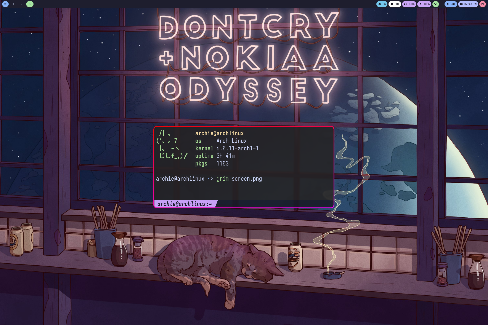
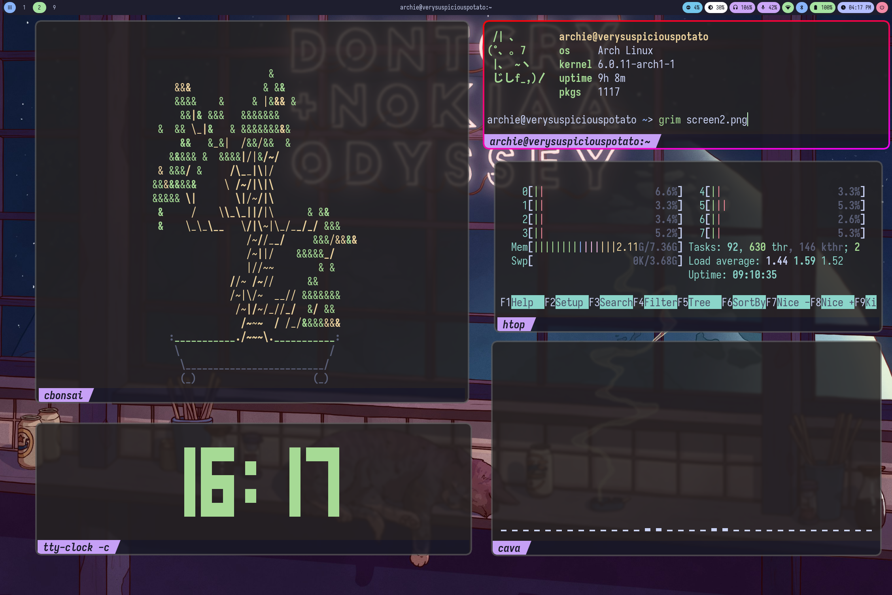
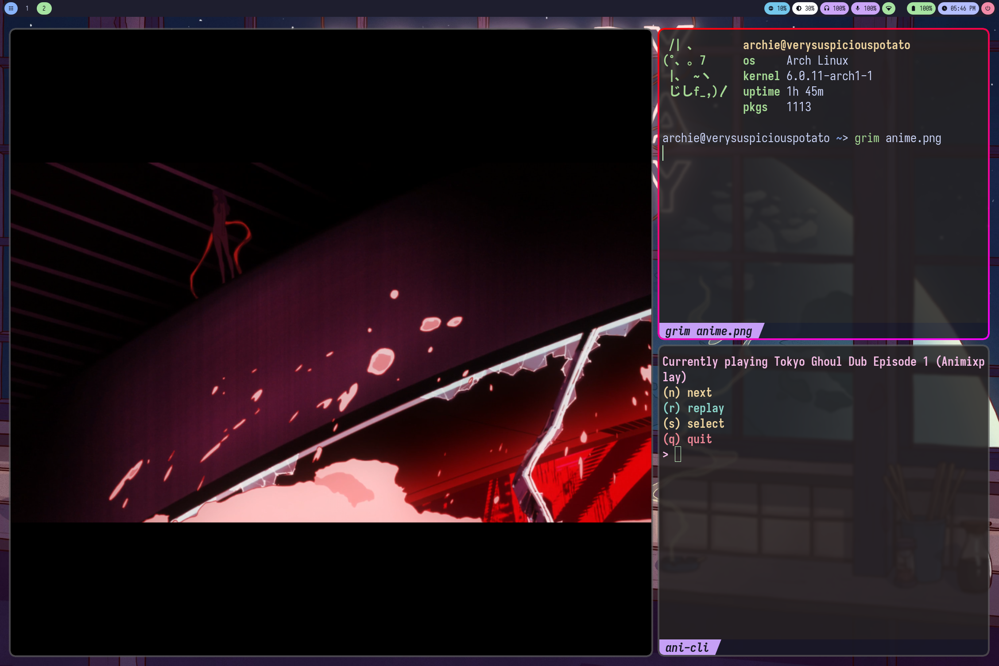

# dots

Dot files for my arch, hyprland config showed on r/unixporn.

## what I use:

- terminal: kitty with catpuccin colors scheme
- waybar
- text_editor: Nvim
- browser: firefox
- fetch_script: pfetch
- shell: zsh with oh-my-zsh
- shell_theme: fishy

## screenshots

## credits:

I basically copy and pasted the waybar from [here](https://github.com/gmr458/.dotfiles)
got the main colors for the terminal as well as the title bar from [here](https://github.com/catppuccin/kitty)

Ps: for those trying to get the catpuccin pfetch to work and there are some characters missing, you aren't missing a certain font, you are missing the alphabet of another language.
you'll find what you need [here](https://www.reddit.com/r/archlinux/comments/niym4p/how_to_install_all_language_fonts/)
